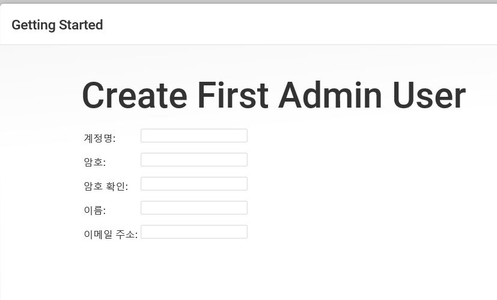
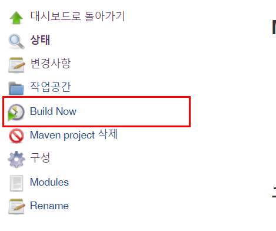

# Jenkins_exam

### 1. 설치하고자 하는 OS 맞게 선택

### 2. 다운로드 받은 프로그램 설치

### 3. 아래 사진처럼 빨간글씨의 경로에 initalAdminPassword 파일 확인하여 입력

### 4. 플러그인 선택 및 설치

### 5. 계정 생성

### 6. Maven 프로젝트 빌드를 위한 젠킨스 설정
- 젠킨스 관리에서 Global Tool Configuration 선택

### 7. JDK 설정

### 8. Maven 설정

### 9. 플러그인 설치
- Maven Integration 플러그인 설치

- 톰캣 서버 배포를 위한 플러그인 설치

### 10. 젠킨스에서 톰캣서버에 접근하기 위해 tomcat_users.xml 수정

'''
<role name="tomcat"/>
<role name="manager-gui"/>
<role name="manager-script"/>
<role name="manager-jmx"/>
<role name="manager-status"/>
<role name="admin-gui"/>
<role name="admin-script"/>
<user role="tomcat,manager-gui,manager-script,manager-jmx,manager-status,admin-gui,admin-script" password="admin" username="admin"/>
'''

### 11. 젠킨스 새로운 아이템(프로젝트) 추가

### 12. SVN 등록

### 13. 계정 등록

### 14. SVN 레포 연결

### 15. Pom.xml 위치 설정

### 16. 빌드 후 옵션 설정

### 17. 빌드

- - -

# 슬랙 + Jenkins

### Browse Apps에서Jenkins를 검색하여 Jenkins CI 를 Install

### Jenkins CI가 설치된 후 Add Configuration 버튼 클릭

### Jenkins로 부터 알림을 받을 채널을 설정 합니다. 채널을 설정한 뒤 Add Jenkins CI integration 버튼을 클릭합니다.

### Setup Instructions 의 Step3의 Team Subdomain 와 Integration Token Credential ID 를 복사하여 둡니다.

### 기타 설정들을 개인 취향에 맞도록 수정한뒤 Save Settings 버튼을 클릭합니다.

### 설정이 완료 되었다면 아래 Configurations에 설정한 항목이 추가된것을 확인할 수 있습니다.

### Jenkins 로 가서 Jenkins 관리 -> 플러그인 관리 로 이동합니다. 설치 가능 항목에서 Slack 을 검색하여 Slack Notification 을 체크하여 설치합니다.

### 설치가 완료 되었다면 Jenkins 관리 -> 시스템 설정 으로 이동합니다.시스템설정에서 Slack 이라는 항목을 찾습니다. 
### WorkSpace에 6번 항목에서 복사해둔 Team Subdomain 을 입력합니다.
### Default channel / member id 항목에 Jenkins 알림을 받기로 한 채널명을 입력합니다.

### Credential 항목의 Add 버튼을 클릭합니다.Kind 에서 Secret text 을 선택 
### Secret에서 6번항목에서 복사한 Integration Token Credential ID 을 입력합니다.
### ID는 적당한 이름으로 작성합니다. 작성이 완료되었다면 Add 버튼을 누릅니다.

### 등록이 완료된후 Test Connection 버튼을 클릭합니다. 설정이 완료되었다면 Success 표시가 뜹니다.그리고 Slack 으로 메시지가 전달됩니다.모든게 완료 되었다면 저장버튼을 클릭합니다.

